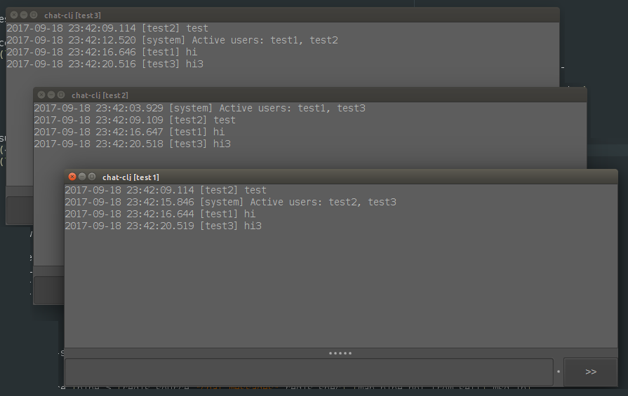

# chat-clj

A simple experiment on core.async and Redis pub/sub patterns. Messages are published into a single
Redis key, but `/list` command creates a short-lived user-specific subscription to which other clients
announce their presence.

This starts a separate process for 3 test users, and uses a local Redis instance:

    echo user1 user2 user3 | xargs -P0 -n1 java -jar target/chat-clj-0.0.1-SNAPSHOT-standalone.jar 127.0.0.1:6379

